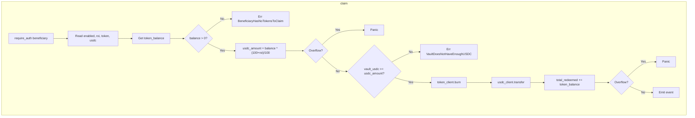

# Security Audit: VaultContract

**Date:** March 2025  
**Contract:** `vault-contract`  
**Scope:** Audit report.
**Author:** [@Villarley](https://github.com/Villarley)

---

## Summary Table

| Severity | Count | Findings |
|----------|-------|----------|
| **Critical** | 2 | F-01, F-02 |
| **High** | 3 | F-03, F-04, F-05 |
| **Medium** | 5 | F-06, F-07, F-08, F-09, F-10 |
| **Low** | 3 | F-11, F-12, F-13 |
| **Informational** | 2 | F-14, F-15 |
| **Enhancement** | 1 | F-17 (Scout) |

**Scout (static analysis):** 4 critical, 5 medium, 1 enhancement. See [Scout Findings](#scout-findings) section.

---

## Executive Summary

The following files of the `vault-contract` were audited in their current state:

- [`vault.rs`](../apps/smart-contracts/contracts/vault-contract/src/vault.rs) — main contract logic
- [`error.rs`](../apps/smart-contracts/contracts/vault-contract/src/error.rs) — typed errors
- [`events.rs`](../apps/smart-contracts/contracts/vault-contract/src/events.rs) — event emission
- [`storage_types.rs`](../apps/smart-contracts/contracts/vault-contract/src/storage_types.rs) — storage keys
- [`test.rs`](../apps/smart-contracts/contracts/vault-contract/src/test.rs) — contract tests

---

## Findings by Severity

### CRITICAL

#### F-01: Missing TTL Extension in Storage

| Field | Details |
|-------|---------|
| **Severity** | Critical |
| **Description** | The contract does not call `extend_ttl` in any operation. In Soroban, instance storage expires if not extended periodically. The `token-factory` contract does extend TTL on every operation that modifies or reads state (see [`contract.rs:86-89`](../apps/smart-contracts/contracts/token-factory/src/contract.rs)). |
| **Impact** | If TTL expires, the vault state (admin, enabled, roi_percentage, token_address, usdc_address, total_tokens_redeemed) is lost. USDC funds would be trapped in the contract address with no way to recover them. |
| **Recommendation** | Add `env.storage().instance().extend_ttl(INSTANCE_LIFETIME_THRESHOLD, INSTANCE_BUMP_AMOUNT)` in all functions that read or write storage, following the token-factory pattern. Define constants similar to token-factory's `storage_types.rs`. |

---

#### F-02: Arithmetic Overflow in Claim Formula

| Field | Details |
|-------|---------|
| **Severity** | Critical |
| **Description** | The expression `token_balance * (100 + roi_percentage) / 100` (lines 172 and 304) uses unverified arithmetic. With extreme values it can cause `i128` overflow. |
| **Impact** | Overflow can cause panic or incorrect results. Although amounts are typically bounded in practice, an attacker with very large tokens or a misconfigured ROI could exploit this. |
| **Recommendation** | Use `checked_mul` and `checked_div`. Add `ArithmeticOverflow` variant to `ContractError` and validate in the constructor that `roi_percentage` is within a reasonable range (e.g. 0–1000). |

---

### HIGH

#### F-03: Constructor Without Input Validation

| Field | Details |
|-------|---------|
| **Severity** | High |
| **Description** | `__constructor` (lines 60-80) does not validate parameters. It accepts: negative or extreme `roi_percentage` (e.g. `i128::MAX`); arbitrary `admin`, `token`, `usdc` addresses (including malicious contracts); `token == usdc` (same contract for token and USDC). |
| **Impact** | Vault deployed with invalid or malicious configuration; loss of funds or unexpected behavior. |
| **Recommendation** | Validate in constructor: `0 <= roi_percentage <= ROI_MAX`; `admin`, `token`, `usdc` are not zero address; `token != usdc`. Optionally verify that `token` and `usdc` implement the expected interface. |

---

#### F-04: Use of `.expect()` in Critical Paths

| Field | Details |
|-------|---------|
| **Severity** | High |
| **Description** | There are 14 uses of `.expect()` in `vault.rs` (lines 146, 156, 162, 177, 221, 237, 245, 253, 262, 297, 314, 343, 361, 367). If the key does not exist (corrupt storage, expired TTL, incorrect migration), the contract panics. |
| **Impact** | Runtime panic; failed transaction; possible gas/fee loss without useful message for the user. |
| **Recommendation** | Replace with `ok_or(ContractError::XxxNotFound)?` in functions that return `Result`. In getters that return values directly, document that they assume initialized state and consider returning `Result` or a safe default where appropriate. |

---

#### F-05: Overflow in `TotalTokensRedeemed`

| Field | Details |
|-------|---------|
| **Severity** | High |
| **Description** | At line 198: `total_redeemed + token_balance` can overflow `i128` if the accumulated total is very large. |
| **Impact** | Overflow → panic; counter desynchronized from actual state if wrapping arithmetic were used. |
| **Recommendation** | Use `checked_add` and propagate the error with `ContractError::ArithmeticOverflow`. |

---

### MEDIUM

#### F-06: `preview_claim` vs `claim` Divergence on Negative ROI / Underflow in `roi_amount`

| Field | Details |
|-------|---------|
| **Severity** | Medium (Scout: CRITICAL for underflow) |
| **Description** | `preview_claim` uses `unwrap_or(0)` for `roi_percentage` (line 291), while `claim` uses `expect` (line 156). With negative ROI, `roi_amount = usdc_amount - token_balance` (line 308) can cause **underflow** if `usdc_amount < token_balance`. Scout: `[CRITICAL] This subtraction operation could underflow`. |
| **Impact** | Underflow → panic; preview can show values inconsistent with actual `claim` result in edge cases. |
| **Recommendation** | Use `checked_sub` for `roi_amount`. Unify storage handling and validate `roi_percentage >= 0` in constructor to avoid negative ROI. |

---

#### F-07: Events Without `#[contractevent]`

| Field | Details |
|-------|---------|
| **Severity** | Medium |
| **Description** | Events are emitted with `env.events().publish((symbol_short!("claim"),), event)` instead of the `#[contractevent]` macro recommended by the SDK. The escrow contract uses `#[contractevent]` in [`events/handler.rs`](../apps/smart-contracts/contracts/escrow/src/events/handler.rs). |
| **Impact** | Events are not included in the contract spec; indexers and clients lack auto-generated types; reduced interoperability. |
| **Recommendation** | Migrate to `#[contractevent]` with appropriate topics and `#[topic]` on key fields (beneficiary, etc.) for indexing. |

---

#### F-08: No Validation of External Contract Addresses

| Field | Details |
|-------|---------|
| **Severity** | Medium |
| **Description** | The `token` and `usdc` addresses are stored without verifying they are valid token contracts. A malicious admin or deployment error could point to malicious contracts. |
| **Impact** | Malicious contracts could implement callbacks in `burn`/`transfer` and cause reentrancy or incorrect logic. |
| **Recommendation** | Document that the deployer must use trusted addresses. Optionally: if the ecosystem provides a token registry, validate against it. Assume the admin is trusted. |

---

#### F-09: Authorization Pattern in `availability_for_exchange`

| Field | Details |
|-------|---------|
| **Severity** | Medium |
| **Description** | The function receives `admin` as a parameter and calls `admin.require_auth()` followed by `admin != stored_admin`. Scout: `[MEDIUM] Usage of admin parameter might be unnecessary` — suggests retrieving admin from storage instead of passing it as a parameter. |
| **Impact** | The pattern is correct. An attacker cannot impersonate the admin without the keys. Best practice is to obtain admin from storage; current design is acceptable but can be improved for clarity. |
| **Recommendation** | Read `stored_admin` first and use `stored_admin.require_auth()` to make explicit that the stored admin is authorized, not the parameter. Remove the `admin` parameter if the signature allows. |

---

#### F-10: Constructor Re-invocation

| Field | Details |
|-------|---------|
| **Severity** | Medium |
| **Description** | There is no explicit protection against a second invocation of `__constructor`. In Soroban the constructor runs on deployment; re-invocation depends on the upgrade/redeploy model. |
| **Impact** | If the constructor could be called again in some upgrade flow, all state would be overwritten. |
| **Recommendation** | Add an initialization flag (like token-factory's `write_escrow_id`/`write_mint_authority`) that panics if already initialized. Document expected behavior on upgrades. |

---

### LOW

#### F-11: Use of `i128` for Non-negative Amounts

| Field | Details |
|-------|---------|
| **Severity** | Low |
| **Description** | Balances, amounts, and ROI are represented with `i128`. Financial amounts are typically non-negative. |
| **Impact** | Allows negative values that are later rejected at runtime; increases surface for sign-related errors. |
| **Recommendation** | Consider newtypes or early validation. Short term: validate `amount >= 0` in constructor for `roi_percentage` and any amount input. |

---

#### F-12: Inconsistency Between `unwrap_or` and `expect` in Getters

| Field | Details |
|-------|---------|
| **Severity** | Low |
| **Description** | `is_enabled` and `get_total_tokens_redeemed` use `unwrap_or(false)`/`unwrap_or(0)`; other getters use `expect`. Inconsistent behavior when storage is empty. |
| **Impact** | Makes it harder to reason about contract state when data is missing. |
| **Recommendation** | Define a clear policy: either all getters assume initialized state (and use `expect` with clear messages), or they return `Result`/documented default values consistently. |

---

#### F-13: `preview_claim` Does Not Return `Result`

| Field | Details |
|-------|---------|
| **Severity** | Low |
| **Description** | `preview_claim` returns `ClaimPreview` directly. If storage read fails (e.g. `expect` on token_address or usdc_address), it panics. |
| **Impact** | A read-only function can panic instead of returning a controlled error. |
| **Recommendation** | Change signature to `Result<ClaimPreview, ContractError>` and propagate errors, or document that it assumes correctly initialized contract. |

---

### INFORMATIONAL

#### F-14: Additional Tests Recommended

| Field | Details |
|-------|---------|
| **Severity** | Informational |
| **Description** | Current tests do not explicitly cover: overflow in claim formula; negative ROI in constructor; behavior with expired TTL (when TTL is implemented); reentrancy scenarios (if custom tokens are used). |
| **Impact** | Lower coverage of edge cases and attack scenarios. |
| **Recommendation** | Add tests for overflow, constructor validation, and (when applicable) TTL and reentrancy. |

---

#### F-15: Code Quality and `no_std`

| Field | Details |
|-------|---------|
| **Severity** | Informational |
| **Description** | The crate uses `#![no_std]` correctly. Tests use `extern crate std` only under `#[cfg(test)]`, which is appropriate. |
| **Impact** | None significant. |
| **Recommendation** | Ensure no dependencies introduce `std` into the production binary. |

---

## Claim Flow Diagram and Failure Points



---

## Related Open Issues

No open issues were found in the repository that explicitly address these findings.

---

## Report Acceptance Criteria

| Criterion | Status |
|----------|--------|
| Each finding includes severity, description, impact, and recommendation | Met |
| Findings classified by severity (Critical / High / Medium / Low / Informational) | Met |
| Indication of related open issues | Met (none existing) |
| Claim flow diagram with failure points | Met |

---

## Scout Findings

Results from static analysis with [Scout](https://github.com/stellar/scout) (Soroban security linter):

| Scout Severity | Location | Description | Correlation |
|----------------|----------|-------------|-------------|
| **CRITICAL** | `vault.rs:171` | Overflow/underflow in `token_balance * (100 + roi_percentage) / 100` | F-02 |
| **CRITICAL** | `vault.rs:198` | Overflow in `total_redeemed + token_balance` | F-05 |
| **CRITICAL** | `vault.rs:303` | Overflow/underflow in `preview_claim` formula | F-02 |
| **CRITICAL** | `vault.rs:308` | Underflow in `usdc_amount - token_balance` | F-06 |
| **MEDIUM** | `vault.rs:142` | Unsafe `expect` — Enabled flag | F-04 |
| **MEDIUM** | `vault.rs:152` | Unsafe `expect` — ROI percentage | F-04 |
| **MEDIUM** | `vault.rs:158` | Unsafe `expect` — Token address | F-04 |
| **MEDIUM** | `vault.rs:173` | Unsafe `expect` — USDC address | F-04 |
| **MEDIUM** | `vault.rs:96` | Admin parameter unnecessary; retrieve from storage | F-09 |
| **ENHANCEMENT** | — | Soroban version: 23.1.1 → 25.3.0 | New |

### Scout Summary

```
+----------------+----------+----------+--------+-------+-------------+
| Crate          | Status   | Critical | Medium | Minor | Enhancement |
+----------------+----------+----------+--------+-------+-------------+
| vault_contract | Analyzed | 4        | 5      | 0     | 1           |
+----------------+----------+----------+--------+-------+-------------+
```

### F-17: Outdated Soroban Version (Scout)

| Field | Details |
|-------|---------|
| **Severity** | Enhancement |
| **Description** | The project uses Soroban 23.1.1. The latest version is 25.3.0. Scout: `#[warn(soroban_version)]`. |
| **Impact** | Possible missing security patches and SDK improvements in the latest versions. |
| **Recommendation** | Update the `soroban-sdk` dependency in the workspace to 25.3.0 (or latest stable). Review changelog for breaking changes. |

---

## References

- [Soroban Security Best Practices — Stellar Developers](https://developers.stellar.org/docs/smart-contracts/guides/security)
- [Soroban SDK — Storage, TTL and Archiving](https://developers.stellar.org/docs/smart-contracts/guides/storage)
- [Soroban SDK — Authorization and require_auth](https://developers.stellar.org/docs/smart-contracts/guides/authorization)
- [Soroban SDK — Events with #[contractevent]](https://developers.stellar.org/docs/smart-contracts/guides/events)
- [Rust — Checked arithmetic: checked_*, saturating_*, wrapping_*](https://doc.rust-lang.org/std/primitive.i128.html#method.checked_add)
- [OWASP Smart Contract Top 10](https://owasp.org/www-project-smart-contract-top-10/)
- [SWC Registry — Smart Contract Weakness Classification](https://swcregistry.io/)
